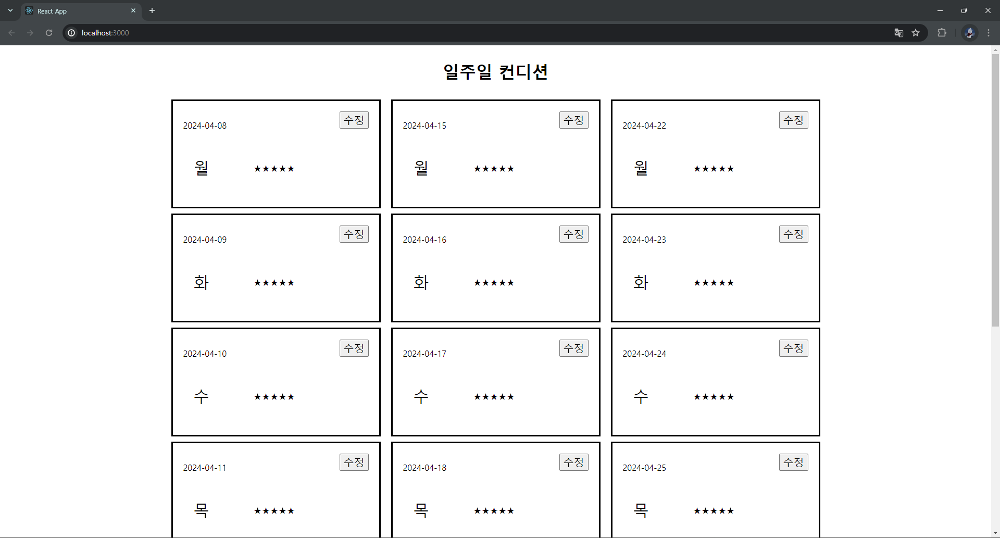

# POB_task_3

- 파일 구성

1. mock_api

   - db.json: api로 사용될 데이터베이스 파일

2. redux

   - slices
     - slice.js: redux에 사용될 slice
   - store.js: redux에 사용될 store

3. router

   - pages
     - detail.jsx: 점수 수정 페이지
     - list.jsx: 점수 리스트를 보여주는 메인 페이지
     - components.jsx: 위의 두 페이지에서 공통적으로 사용되는 컴포넌트
   - router.js: 페이지 링크 지정

- 동작 설명

  api에서 받아온 데이터를 리스트화 시켜보여주고
  수정버튼을 눌러 api에 직접 접근해 데이터 수정이 가능합니다

  - 초기 실행 화면  
    
  - 수정 페이지  
    
